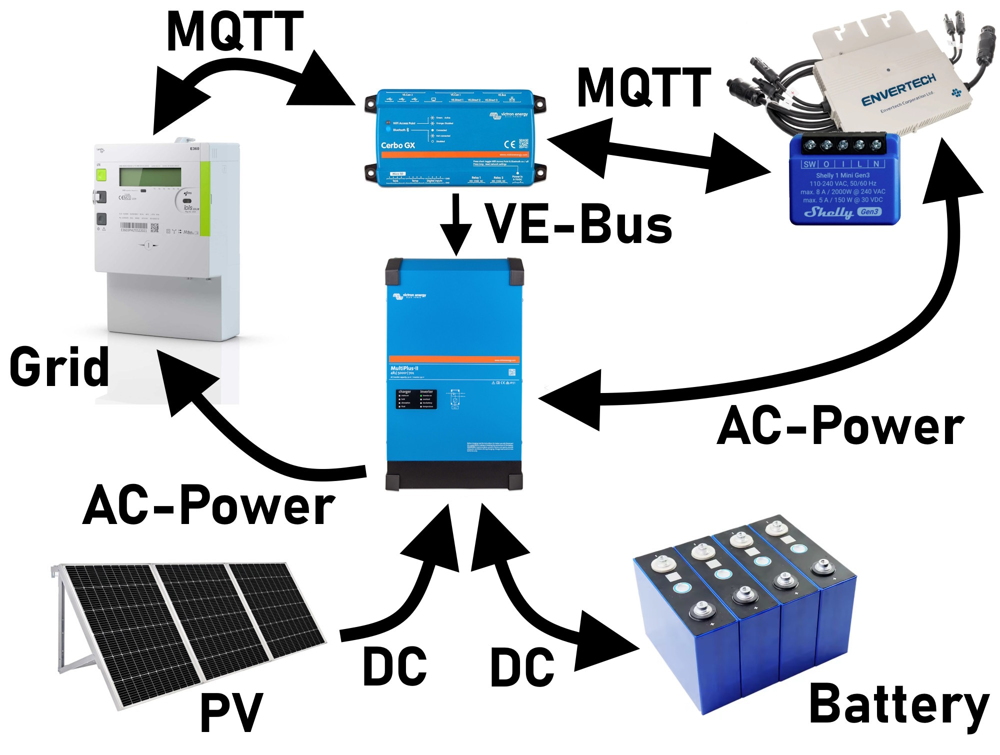

# About this project
Within this repository you will find some scripts to add an PV-meter (Shelly EM) and/or a Grid-Meter to the Victron System. Both scripts are receiving their information via MQTT from an MQTT-broker. So all different types of meters could be used.

The general idea is to use the Victron-system together with external micro-inverters without a proper communication to Victron as well as a DIY infrared-reader for the Landis and Gyr Grid-meters to create a zero-feed-in system like shown in the next picture:

## Grid-Meter
The grid-meter-script expects only three MQTT-topics to work:

- MQTT_PATH/power
- MQTT_PATH/180
- MQTT_PATH/280

The power has to be submitted in "Watt" and the two energies in "Watt-hours". The power is then distributed over all three phases automatically. If your grid-meter supports individual phase-powers, you might use the three topics MQTT_PATH/p_l1 to .../p_l3.

## PV-Meter
The PV-Meter is supposed to be a Shelly PM Mini Gen3 that is able to send MQTT without any changes in the software. The following topics are expected: 

- MQTT_PATH/power
- MQTT_PATH/voltage
- MQTT_PATH/current
- MQTT_PATH/frequency
- MQTT_PATH/energy_180
- MQTT_PATH/energy_280

All parameters are in their basic units, like Watt, Ampere, Volt, Watt-hours.

## Example of the Victron GUI
Here is an example, how this could look like:

## Installation
Short instruction to install this script as a service:
1. Copy all files to /data/pvmeter on the VenusOS (CerboGX or RaspberryPi)

2. set permissions
chmod 755 /data/pvmeter/service/run
chmod 744 /data/pvmeter/kill_me.sh

3. install / uninstall service
bash -x /data/pvmeter/install.sh
bash -x /data/pvmeter/uninstall.sh

4. check status
svstat /service/pvmeter

5. in case of errors debug:
python /data/pvmeter/MQTTtoPV.py

If paho-mqtt is not installed, use this to install the dependencies:
python -m ensurepip --upgrade
pip install paho-mqtt

## Some credits
Parts of this code are based on the work of Ralf Zimmermann (mail@ralfzimmermann.de) in 2020.
The orginal code and its documentation can be found on: https://github.com/RalfZim/venus.dbus-fronius-smartmeter
Used https://github.com/victronenergy/velib_python/blob/master/dbusdummyservice.py as basis for this service.